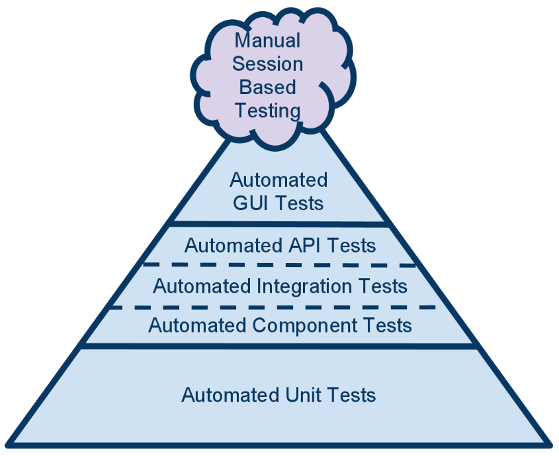

# Niveles de Pruebas 🔬
## Introducción 🚀
Habitualmente, cuando se habla de automatizar procesos de testing en el mundo del software, se asocia a automatizar la ejecución de pruebas solo a nivel de interfaz gráfica. De forma tradicional, los proyectos que tenían algún tipo de prueba automática lo concentraban en esta capa. Además, estos ciclos de prueba eran completamente End-to-End, es decir, podían probar un ciclo de pruebas o proceso de negocio completo, desde el inicio hasta el final, lo que las hace muy susceptible a los cambios y muy costosas para mantenerlas vivas, con el consiguiente número de falsos positivos en cada ejecución. Esto deteriora la confianza en las pruebas, que es uno de los objetivos claves de la calidad, y que es necesario mantener independientemente de que el proceso sea manual o automático. El catálogo principal de las pruebas eran manuales y costosas, existiendo contados Unit Test o ninguno, que se evitaban con un "Skip" en fase de compilación por estar obsoletos o por no ofrecer garantías.

## Pirámide de Pruebas 🔺
La Pirámide de Prueba, atribuida al agilista Mike Cohn y muy conocida en los modelos de testing modernos, ofrece un punto de partida para la definición de la estrategia de testing de un producto. Se propone la utilización de este paradigma para garantizar la calidad de los mismos en todo los niveles, e involucrando a todas las partes que componen un proyecto.

* **Units Tests**

Empezando por la parte inferior de la pirámide, se ubican los test unitarios o Unit Test, que representan la parte más extensa de la pirámide de automatización y, por tanto, contienen el grueso de test del sistema. Los test unitarios brindan feedback muy específico y rápido sobre la calidad de pequeñas piezas del producto (funciones, métodos...) que tienen un comportamiento concreto. Se recomienda la utilización de principios TDD para dar soporte a este nivel en especial, aunque también puede aplicarse en los niveles de componentes e integración.

* **Component Tests**

Debajo de los test de integración se ubican los test de componentes o Component Test. En este nivel encontramos las pruebas que validan un componente o funcionalidad completa para validar si la salida del mismo es la esperada. La principal diferencia con los test unitarios es que en ese nivel validaba el componente en pequeñas piezas y de forma independiente.

* **Integration Tests**

A continuación de los test de componentes, debería existir una base de test de integración de componentes o Integration Test. El objetivo de estos test es garantizar que los diferentes componentes, que han sido desarrollados de forma independiente, se integran entre sí de forma correcta y se garantiza que trabajan juntos como se esperaba. Para estas pruebas puede ser necesario realizar Mocks para simular cierto comportamiento externo, ya que probar con todo integrado es objetivo de otros niveles de prueba más End-to-End.

**Quien se encarga** Serán implementadas y mantenidas por el equipo de desarrollo, ya que necesitan un amplio conocimiento técnico y de la funcionalidad que se desea cubrir.
Los perfiles de calidad estarán alineados con ellos y darán feedback para determinar el alcance de las pruebas y su cobertura.

..........................................................................................

* **API/Service Tests**

En la parte media de la pirámide, estarán los test que prueban las funcionalidad del producto, ofrecida por las APIs o servicios, y que son consumidos por los clientes, entre los que se encuentran las interfaces de usuario. Son pruebas con una alta integración, ya que no testean un componente de forma aislada, sino un conjunto de ellos que interactúan entre sí de forma real (sin Mocks) para cubrir un requisito de negocio. En este nivel se puede comenzar a utilizar principios BDD ya que los test están guiados por comportamientos que un rol de negocio ha definido.

* **E2E Tests**

En la parte alta de la pirámide se encuentran los test de interfaces que prueban la aplicación de “punta a punta” (End-To-End, E2E) a través de la interfaz de usuario. Generalmente es preferible realizar los mínimos test de este tipo que cubran la mayor cantidad de funcionalidad posible, debido a su fragilidad y alto costo de mantenimiento. Se utilizará ya en este nivel frameworks para la automatización de la capa gráfica, como Selenium o Cypress.

**Quien se encarga** Los escenarios deben ser definidos a alto nivel por perfiles de negocio, por ejemplo, a través de historias de usuario.
Serán implementadas de forma inicial por el equipo de desarrollo y ampliadas o mejoradas por los perfiles de calidad, siempre reutilizando los mismos activos de prueba y generando un catálogo de test único.

.......................................................................................

* **Manual Tests**

Para cada versión software, habrá cambios que no se puedan validar de forma automática, ya sea por coste o por viabilidad técnica. Por este motivo, se proponen baterías de pruebas manuales, donde el diseño se realizará en la Herramienta de Gestión de Pruebas, para mantener la trazabilidad. Podrá darse el caso de que sea necesario registrarlas, haciendo el diseño a la vez que se realiza la ejecución, en forma de Pruebas Exploratorias.

**Quien se encarga**Las realizarán los perfiles de calidad preferentemente, alineadas con el resto de equipos.

.........................................................................................

* **Aceptance Tests**

Aunque no es un nivel de la pirámide, no se deben olvidar los Acceptance Test. Son pruebas que tienen como objetivo validar la alineación del software desarrollado con el negocio. Son pruebas de base también exploratorias que no necesitan estar registradas en herramientas de pruebas, más allá de dejar constancia de ellas a nivel de Criterios de Aceptación dentro de la Historia de Usuario, si el proyecto las estuviera definiendo.

**Quien se encarga** Las realizan los usuarios, perfiles de negocio o responsables del producto, como último paso para validar un comportamiento correcto.

## Niveles de Pruebas en base a Criticidad de los Procesos de Negocio 📝

Cuando se disponga de pruebas para todos los niveles de la pirámide será necesario hacer una subdivisión en aquellos donde el diseño y la ejecución sean costosos (por ejemplo, niveles API y E2E), para intentar focalizar en los procesos críticos cuando no sea posible cubrir todo el catálogo de pruebas.

* **Smoke Tests**

Conjunto de pruebas que verifican el correcto funcionamiento de la funcionalidad más crítica del Sistema. Validan que está funcionando correctamente tras un despliegue o instalación, garantizando que el producto está listo para ejecutar otros niveles de prueba. Suelen utilizarse para validar los despliegues de los Pipeline de Despliegue Continuo.

* **Sanity Tests**

Conjunto de pruebas que verifican rápidamente las funcionalidades más críticas del sistema, con más alcance que los Smoke Tests.

* **Regression Tests**

Conjunto de pruebas que realizan una regresión completa de la funcionalidad del sistema, probando la mayoría de los procesos de negocio, para validar que las modificaciones incluidas recientemente no provocan errores inesperados.

* **Integration Tests**

Conjunto de pruebas que ponen el foco en las funcionalidades que tienen integraciones con otros productos o sistemas horizontales, para verificar que funcionan de forma correcta tras cambios o despliegues.

Tanto las pruebas automáticas como las pruebas manuales deben estar etiquetadas con su nivel correcto, usando las siguientes etiquetas:

@SmokeTest

@SanityTest

@RegressionTest

@IntegrationTest