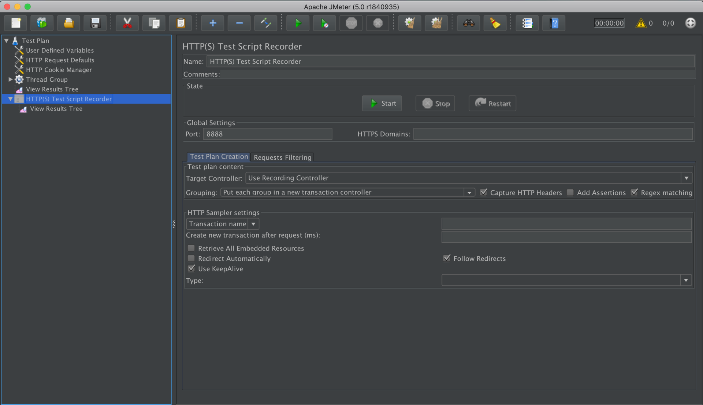

# Introducción a JMeter 🚀

_En esta sección iremos explicando algunos conceptos básicos de JMeter, estos apuntes estan basados en lo parendido en la estancia en la JDA._


## Descripción 📋 

JMeter es una herramienta de testing cuyas funcionalidades se pueden resumir en tres:

* Diseñar un testplan, esto es, generar un fichero .jmx
* Ejecutar un testplan
* Ver de distintas formas los resultados de la ejecución de un testplan (vía listeners)

Para diseñar un testplan, JMeter dispone de una interfaz GUI a modo de diseñador, en la que el tester puede ir agregando componentes de manera visual, y ejecutar los componentes agregados, viendo el resultado. Una vez finalizado el diseño del testplan, la herramienta permite grabar este como un fichero .jmx.

La propia herramienta permite ejecutar un fichero .jmx previamente generado, vía línea de comandos o vía la propia interfaz GUI. La ejecución de un fichero .jmx realiza peticiones contra la aplicación objetivo a testear (peticiones del tipo que se hayan especificado al generar el fichero .jmx, JMeter dispone de la posibilidad de generar muchos tipos de peticiones: HTTP, FTP, LDAP, ...). Para cada petición ejecutada, JMeter recopila ciertos datos. Además, en el fichero .jmx se puede especificar que número de usuarios de cada tipo ejecuta las peticiones contra la aplicación, es decir, el .jmx simula una o mas comunidades de usuarios (roles) trabajando contra la aplicación objetivo.

Los datos generados por la herramienta para cada petición se procesan o bien con un tipo de componente que proporciona la interfaz GUI llamados listeners, o bien con herramientas externas. Los listeners permiten ver los resultados de una o mas ejecuciones de múltiples maneras (cada listener de una manera).

Este manual es una introducción al uso de la herramienta JMeter. Explica los conceptos básicos que es necesario conocer para entender la herramienta, y las posibles formas de utilizar ésta.

Es adecuado tanto para personas con un perfil técnico sin conocimientos previos que deseen iniciarse en el uso de la herramienta, como para diretores, jefes de proyecto y analistas que deseen conocer las posibilidades de la herramienta en la ejecución de tests.

## Instalación, configuración, y acceso a la documentación 🔧

**Descargar** el software de https://jmeter.apache.org/ (sitio oficial del proyecto).

**Prerequisitos:** JRE  o JDK ?????

**Instalación:** Basta con descomprimir en un directorio (por ejemplo en /usr/local/ en Unix/Linux, o C: en Windows), el paquete de distribución del software (.zip o .tgz).
Aunque para usar JMeter no es imprescindible, se recomienda crear una variable de entorno (por ejemplo de nombre JMETER_HOME), cuyo valor sea al path absoluto al directorio de instalación. En lo que sigue, asumiremos que esta variable ha sido creada. Si por alguna razón, esta variable no existe, sustituir las expresiones %JMETER_HOME% (Windows) ó ${JMETER_HOME} por el path absoluto al directorio raiz de la instalación de JMeter, aquellos sitios donde las utilicemos.
Aunque para usar JMeter tampoco es imprescinbible, se recomienda descargar e instalar los plugins para JMeter del proyecto JMeter Plugins. Estos plugins añaden componentes adicionales a los que JMeter implementa por defecto. Descarga e instrucciones de instalación en el sitio del proyecto.

**Comprobación de la instalación:**

```
${JMETER_HOME}/bin/jmeter.sh --version
```

debería mostrar un texto como el siguiente:

```
Copyright (c) 1998-2010 The Apache Software Foundation
  Version 2.4 r961953
```

**Configuración:** La ejecución de JMeter se configura vía ficheros de propiedades o vía opciones de línea de comando (información sobre esto más adelante). El fichero jmeter.properties establece la mayoría de las propiedades de configuración.
Hay un aspecto de la configuración que merece cierta atención: en la interfaz GUI se puede consultar ayuda contextual sobre un componente de un testplan haciendo click en la opción Ayuda> del menú emergente. JMeter busca la ayuda contextual por el nombre en Inglés del tipo de componente. Si la interfaz GUI está configurada en Español, los nombres de los tipos de componentes figuran traducidos, por lo que no le es posible encontrar la ayuda. Por esta razón, y porque el manual de usuario del producto está en Inglés, se recomienda configurar la interfaz GUI en idioma Inglés. Para ello, establecer en el fichero ${JMETER_HOME}/bin/jmeter.properties la propiedad language: language=en.

**Ejecutar JMeter** (la interfaz GUI):
```
${JMETER_HOME}/bin/jmeter.sh
```

## Utilización de la herramienta 🛠️

Una vez instalada la herramienta, la forma más habitual de utilizarla es:

**1-** **Grabar las interacciones de cada uno de los tipos de usuarios con la aplicación software.** Esto genera un caso de pruebas para cada una de las tipologías de usuarios (perfiles) que admite la aplicación. Posteriormente, cada uno de los casos de prueba se ejecutarán de manera concurrente por parte de N usuarios por cada caso de prureba.

**2- Adaptar el script (fichero .jmx) generado en el paso anterior.** Por ejemplo, para que sea configurable, para que se hagan comprobaciones que no se pueden generar durante la grabación, ...

**3- Comprobar que el script realiza correctamente las tareas que se desea que realice el caso de prueba.**

**4- Integrar todos los scripts.**

**5- Ejecutar el testplan.**

**6- Visualizar los resultados de la ejecución.**

## Como funciona JMeter ⚙️

* La interfaz GUI de JMeter nos permite construir un testplan. (enlace)
* Una vez construido un testplan, este consiste en un fichero con extensión (por defecto) .jmx. (enlace)
* Un testplan se puede ejecutar desde la línea de comando o desde la interfaz GUI. (enlace)
* Brevemente, lo que hace un testplan durante su ejecución es crear el número de threads que se especifican en él. Cada thread representa a un usuario (virtual), que realiza con la aplicación objetivo a testear, las interacciones que se especifican en el testplan. Todos los usuarios (threads) de un mismo grupo (los threads se pueden agrupar, véase el componente Thread Group), realizan las mismas interacciones con la aplicación. Las interacciones de los usuarios virtuales con la aplicación las realizan un tipo de componente del testplan denominados samplers que son los que hacen peticiones a la aplicación objetivo a testear. Existen samplers de diferntes tipos, para hacer peticiones HTTP, peticiones FTP, peticiones LDAP, … (enlace)
* Durante la ejecución de un testplan, JMeter captura varios datos sobre todas y cada una de las peticiones realizadas por los samplers del testplan a la aplicación objetivo. Entre los datos capturados para cada petición están: timestamp de la petición, identificación del grupo de threads y thread que realiza la petición, URL de la petición, resultado de la petición, tiempo de respuesta, … La forma en que se capturan las peticiones realizadas por los samplers es en ficheros, bien en formato CSV o bien en formato XML (ficheros .jtl). Estos ficheros se llaman result samples o sample result o simplemente ficheros sample o ficheros result. 
* De la lista de peticiones capturadas durante la ejecución de un testplan pueden extraerse muchas series estadísticas. Estas series estadísticas pueden procesarse para calcular diferentes magnitudes. Así por ejemplo, si la serie estadística consiste en el tiempo de respuesta de cada petición, pueden hallarse varias magnitudes sobre el tiempo de respuesta de la aplicación: la media, el máximo, el mínimo, la mediana, la desviación estándard, el percentil 90, … 
* Por otra parte, en JMeter existe un tipo de componente denominado listener. Los listeners son componentes que permiten procesar la información capturada por JMeter durante la ejecución de un testplan. Cada tipo de listener procesa la información capturada de una manera: unos la muestran en forma de tabla calculando diferentes magnitudes estadísticas, otros la muestran en forma de gráfica, otros simplemente salvan la información previamente filtrada a un fichero, … La clave es que todos los listeners independientemente de como procesen la información, parten de la misma información base: los datos de todas y cada una de las peticiones capturadas durante la ejecución de un testplan. Los listeners se suelen utilizar de dos maneras:

        * Una vez capturadas las peticiones del testplan en un fichero .csv ó .jtl, el fichero se puede cargar en el listener (en la interfaz GUI), y ver la información capturada de la forma como la muestra el listener.

        * En la interfaz GUI, durante la ejecución de un testplan los listeners muestran en tiempo real el resultado de procesar la información que se va capturando.

## Artefactos software 📦

En este apartado enumeraremos y explicaremos en que consisten los diferentes tipos de artefactos software relacionados con JMeter:

### Ficheros de propiedades (*.properties)
JMeter se basa en varios ficheros de propiedades que configuran diferentes aspectos de la ejecución.
El principal es _${JMETER_HOME}/bin/jmeter.properties_, en el que se especifica la mayoría de las propiedades de configuración. Se aconseja consultar los comentarios de este fichero, para información sobre las posibilidades de configuración.
Hay varias propiedades de este fichero que referencian a otros ficheros de propiedades (de nombre configurable), que también se leen durante el arranque de JMeter. Las mencionamos con sus valores por defecto:

* httpclient.parameters.file=httpclient.parameters
* user.properties=user.properties
* system.properties=system.properties

Para cambiar la configuración de JMeter vía ficheros de propiedades, editar el fichero .properties y rearrancar JMeter.

### Ejecutables de línea de comando

En el directorio _${JMETER_HOME}/bin/_:

* jmeter, jmeter.sh, jmeter.bat

Ejecutan JMeter desde línea de comando o la interfaz GUI. 

* jmeter-server, jmeter-server.bat

Ejecutan JMeter en modo servidor (ver modo de ejecución).

* shutdown.sh, shutdown.cmd

Para la ejecución de un testplan de forma no abrupta.

* stoptest.sh, stoptest.cmd

Idem, de forma abrupta.

* mirror-server, mirror-server.cmd

JMeter dispone de un servidor HTTP embebido que se puede usar con propósitos de depuración durante la construcción de un testplan.

* jmeter-*.cmd

Ejecutables específicos de Windows para ejecutar un testplan arrastrando y soltando.

### Interfaz GUI
JMeter se puede ejecutar de dos formas: vía línea de comando o vía la interfaz GUI. De las dos maneras podemos ejecutar un testplan. Pero además, la interfaz GUI sirve para diseñar un testplan.

Por defecto los ejecutables del directorio _${JMETER_HOME}/bin/_ arrancan JMeter en modo GUI. Si se desea sólo ejecutar un testplan desde línea de comando sin mostrar la interfaz GUI, hay que usar los modificadores -n y -t (enlace).

La imagen siguiente muestra el aspecto de la interfaz GUI para la version actual de JMeter (2.4):



En el frame de la izquierda se muestra un árbol que constituye el testplan. Este árbol es la forma en que JMeter nos muestra el testplan.

Cada nodo del árbol es un componente que el tester añade al árbol en tiempo de construcción del testplan.

Cada componente es de un tipo de componente concreto, y según el tipo del componente, al seleccionarlo se muestra un panel de control diferente en el frame de la derecha. 

Editando los campos del panel de control de cada componente es como se configura el comportamiento de éste en el testplan.

Hay tres campos que existen en cualquier panel de control independientemente del tipo de componente: el tipo del componente ("Response Assertion" en la imagen), campo "Name" (que por defceto es el mismo que el tipo del componente), y campo "Comments" (para explicar lo que se necesite sobre el componente). El tester puede poner cualquier texto en los dos últimos al construir el testplan.

La forma en que se añade un nuevo componente a un nodo del árbol una vez seleccionado es mediante la opción Edit > Add ó Edit > Insert Parent, o bien mediante el menú emergente del componente selecionado.

Los nodos del árbol admiten operaciones de Copiar, Cortar, Pegar, Eliminar, Activar/Desactivar, Mover (arrastrando y soltando), ...

Físicamente en disco, un testplan es un fichero .jmx: cuando el tester graba el testplan JMeter genera un fichero .jmx (en la barra de título se muestra el fichero que tenemos abierto en este momento).

El menú Run tiene opciones para ejecutar el testplan y parar la ejecución. Durante la ejecución de un testplan se muestran dos números (N/M) en la esquina superior derecha. N es el número de threads activos en cada momento, y M es el número total de threads que crea el testplan (más sobre threads en el apartado Como funciona JMeter).