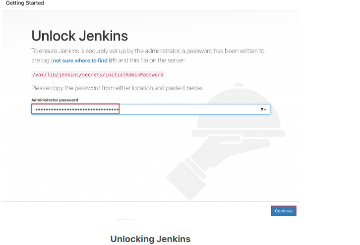
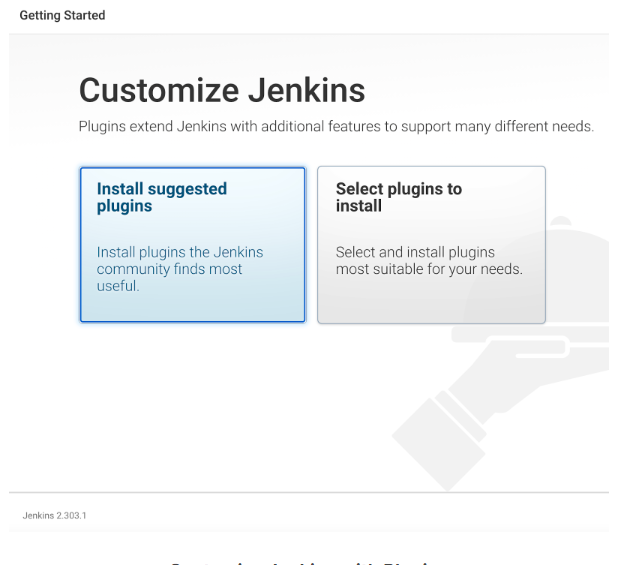
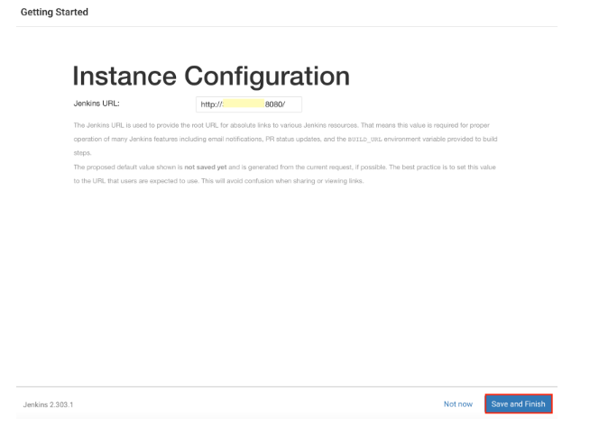
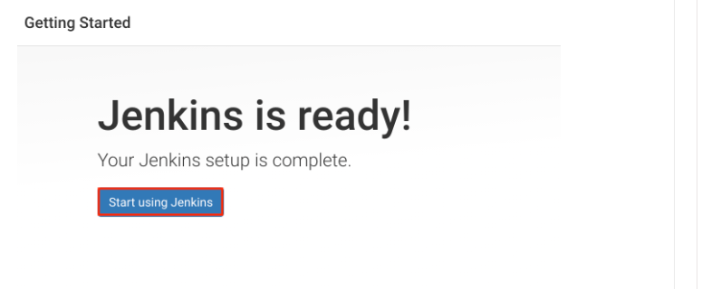

# Introducción

En este capítulo, repasaremos los requisitos previos necesarios para instalar Jenkins y explicaremos cómo puede configurar un servidor de automatización de Jenkins.

# Jenkins y Java

Jenkins está escrito en Java, un lenguaje de programación independiente de la plataforma. Como cualquier otra aplicación Java, se puede instalar en una variedad de sistemas operativos como Linux, Windows, MacOS, etc.

# Lanzamientos de Jenkins

El proyecto Jenkins produce dos líneas de lanzamiento: LTS (soporte a largo plazo) y semanal.

| Stable (LTS) | Regular Releases (Weekly) | 
| -- | -- | 
|Lanzamiento cada 12 semanas. Seleccionado del flujo de lanzamientos regulares como el lanzamiento estable para ese período de tiempo. | Lanzado semanalmente para ofrecer correcciones de errores y funciones a los usuarios finales y desarrolladores de complementos. |

# Requisitos previos para instalar Jenkins

Antes de instalar Jenkins, debe asegurarse de que su sistema cumpla al menos con los requisitos mínimos de hardware y software:

- RAM de 256 MB

- 1 GB de espacio en disco (10 GB si se ejecuta como contenedor Docker)

- Java 8 o Java 11

- Navegadores web modernos: Google Chrome, Mozilla Firefox, Microsoft Internet Explorer, Apple Safari.

Estos requisitos mínimos son lo suficientemente buenos para comenzar, por ejemplo, con fines de desarrollo o prueba. Sin embargo, estos deben ajustarse para la producción, ya que los sistemas de producción necesitan muchos más recursos. [Jenkins Documentation](https://www.jenkins.io/doc/book/scaling/hardware-recommendations/) tiene recomendaciones sensatas sobre cómo establecer los requisitos de hardware para su sistema de producción.

# Canales de Instalación

Jenkins se distribuye a través de muchos canales:

- Standalone WAR
- Gestores de paquetes de Linux (RPM, DEB, etc.)
- Instaladores de Windows
- Contenedores

Instalar Jenkins es bastante sencillo. Una instalación típica tarda unos 10 minutos. La [documentación de instalación de Jenkins](https://www.jenkins.io/doc/book/installing/) tiene instrucciones completas para usar cada uno de estos canales para la instalación. En las siguientes páginas, exploraremos la instalación de Jenkins utilizando cada uno de los canales de distribución mencionados anteriormente.

## Standalone WAR

Con este método, Jenkins se ejecuta como una aplicación independiente en su propio proceso con su contenedor de servlet de Java integrado, Jetty. Esta aplicación independiente se puede descargar como un archivo Java WAR (Web Application Archive) con extensión **.war**. Este archivo WAR puede ejecutarse en cualquier sistema operativo, Linux, Windows, Mac OS, etc.

Estos son los pasos para lanzar Jenkins como una standalone war:

- Descargue el archivo **jenkins.war** de la descarga e implementación de Jenkins.
- Inicie una ventana de terminal y ejecute el siguiente comando:

`java -jar jenkins.war`

De manera predeterminada, Jenkins usa el puerto 8080. Su aplicación de Jenkins estará disponible en **http://<su dirección IP>:8080**. Puede pasar argumentos JVM adicionales especificando JENKINS_OPTS y JAVA_OPTS a la llamada de Java como se muestra a continuación:

`java ${JAVA_OPTS} -jar jenkins.war ${JENKINS_OPTS}`

Aquí hay un ejemplo del uso de banderas de inicio:

`java -Dhudson.footerURL=http://example.org -jar jenkins.war \ --httpPort=8083 --prefix=/ci --httpListenAddress=127.0.0.1`

En este ejemplo:

- establecer la propiedad del sistema Java **(JAVA_OPTS) -Dhudson.footerURL=http://example.org** cambiará el pie de página predeterminado en la interfaz de usuario de Jenkins a http://example.com
- -**-httpPort**, **--prefix** y **--httpListenAddress** son las banderas proporcionadas como **JENKINS_OPTS**.
- **--httpPort=8083** establecerá el puerto de Jenkins en 8083 en lugar del 8080 predeterminado.
- **--prefix=/ci** agregará un prefijo al final de la URL de Jenkins.
- **--httpListenAddress=127.0.0.1** vincula a Jenkins con la dirección IP.

Finalmente, solo se podrá acceder a un servicio de Jenkins lanzado por el comando anterior en http://127.0.0.1:8083/ci.

Para obtener una lista de todas las opciones de JAVA y JENKINS disponibles, consulte ["Características de Jenkins controladas con las propiedades del sistema"](https://www.jenkins.io/doc/book/managing/system-properties/) .

##  Linux Package Managers

Los administradores de paquetes de Linux brindan una forma estable y automatizada de instalar y administrar una variedad de programas. Puede usar administradores de paquetes de Linux, como RPM, DEB, OpenSUSE, etc., para instalar Jenkins.

El archivo WAR independiente (jenkins.war) sigue siendo la base para la instalación del administrador de paquetes. Sin embargo, tiene algunos beneficios adicionales, como la creación automática de usuarios de Jenkins, scripts de inicio, rotación de registros, etc.

Aquí hay un ejemplo de cómo puede instalar Jenkins LTS (soporte a largo plazo) en Ubuntu usando el administrador de paquetes APT. Deberá importar la clave GPG para el repositorio APT, agregar el repositorio a la lista de fuentes, actualizar el índice del paquete e instalar.

```
Import the GPG key for Jenkins repo
wget -q -O - https://pkg.jenkins.io/debian/jenkins.io.key \
| sudo apt-key add -
# Add the repo to the list of sources
sudo sh -c 'echo deb https://pkg.jenkins.io/debian-stable binary/ > \
/etc/apt/sources.list.d/jenkins.list'
#Update package index
sudo apt-get update
#Install Jenkins
sudo apt-get install jenkins

```

Puede iniciar, detener y verificar el estado de Jenkins ejecutando el comando systemctl:

```
systemctl start|stop|status jenkins
```

Tenga en cuenta que se crea un archivo de configuración de Jenkins en **/etc/default/jenkins**. Aquí es donde modificará muchas de las opciones de Java y Jenkins. Por ejemplo, si desea cambiar el puerto de Jenkins de 8080 a 8083, aquí es donde debe realizar el cambio.

Algunas otras cosas a tener en cuenta son las ubicaciones del directorio de inicio de Jenkins, los scripts de inicio y el archivo de registro.

El script de inicio se encuentra en **/etc/init.d/jenkins**.

De forma predeterminada, el directorio de inicio de Jenkins está configurado en **/var/lib/jenkins** y el archivo de registro se encuentra en **/var/log/jenkins**. Estos se pueden cambiar en el archivo de configuración de Jenkins a una ubicación de su preferencia.

## Windows Installers

El paquete MSI de Microsoft Windows Jenkins viene completo con el requisito previo de Java Runtime Environment (JRE) y Microsoft .NET 2.0 framework. Este paquete proporciona una experiencia de instalación de Jenkins perfecta y alivia la necesidad de cualquier instalación de software de requisito previo externo.

Al usar el paquete de instalación de MSI, el asistente de instalación de Jenkins se instalará automáticamente como un servicio de Windows. Ejecutar Jenkins como un servicio de Microsoft Windows facilita la administración de aplicaciones, ya que los servicios de Windows brindan una manera fácil de especificar pasos correctivos en caso de que la aplicación falle.

Descargue la última versión de  ["Jenkins para Windows"](https://www.jenkins.io/download/) en una carpeta de su elección.

Descomprima el archivo en una carpeta y haga doble clic en el archivo **exe** de Jenkins y siga las indicaciones para completar la instalación.

Esto configurará Jenkins como un servicio de Windows. Puede verificarlo yendo a *Inicio > Panel de control > Herramientas administrativas > Servicios*.

Tenga en cuenta que el archivo de configuración de Jenkins se encuentra en **C:\Program Files\Jenkins\jenkins.xml**.

## Application Containers

Dado que Jenkins se distribuye como un archivo WAR ordinario, es fácil implementarlo en cualquier servidor de aplicaciones Java estándar, como Tomcat, Jetty o GlassFish. Podría decirse que ejecutar Jenkins en un servidor de aplicaciones es más complicado de configurar y mantener. También pierde ciertas funciones de administración agradables, como la capacidad de actualizar Jenkins o reiniciar el servidor directamente desde Jenkins. Por otro lado, los administradores de su sistema pueden verse aliviados de la sobrecarga de administrar varios servidores.

La instalación del contenedor de aplicaciones es un proceso de dos pasos:

- Copie **jenkins.war** al directorio de **webapps**.

- Reiniciar el contenedor web de la aplicación.

##  Docker Container

Para ejecutar Jenkins como un contenedor, primero debe instalar Docker en su sistema operativo. Visite el sitio web de la tienda de Docker ["tienda de Docker"](https://hub.docker.com/search?type=edition&offering=community&q=) y haga clic en el cuadro Docker Community Edition que sea adecuado para su sistema operativo o servicio en la nube. Siga las instrucciones de instalación proporcionadas en el sitio web de Docker.

El siguiente paso es descargar la ["imagen de Jenkins Docker"](https://hub.docker.com/r/jenkins/jenkins/), ya sea LTS o semanalmente.

## Kubernetes

Para ejecutar Jenkins en Kubernetes, puede utilizar los gráficos de Helm. Helm es el administrador de paquetes que se usa para buscar, compartir y usar software creado para Kubernetes. Puede encontrar el gráfico oficial de Helm para Jenkins ["Helm para Jenkins"](https://github.com/jenkinsci/helm-charts) en GitHub.

## Asistente de configuración posterior a la instalación

El asistente de configuración posterior a la instalación comienza tan pronto como inicia una instancia de Jenkins recién instalada. Este asistente de configuración lo guía a través de los pasos para desbloquear Jenkins, personalizarlo con complementos y crear el primer usuario administrador a través del cual puede acceder a la interfaz de usuario de Jenkins.

## Asistente de configuración posterior a la instalación: desbloqueo de Jenkins

Cuando accede por primera vez a una nueva instancia de Jenkins, se le pide que la desbloquee con una contraseña generada automáticamente.

Siga las instrucciones en pantalla y pegue la contraseña en el campo Contraseña del administrador y haga clic en Continuar para continuar con la instalación de complementos.



## Asistente de configuración posterior a la instalación: Personalización de plugins

Antes de que pueda comenzar a usar Jenkins, deberá instalar complementos. En esta pantalla, debe seleccionar una de las dos opciones:

Instalar complementos sugeridos
Esto instalará el conjunto recomendado de complementos, un conjunto basado en los casos de uso más comunes. Le recomendamos que seleccione esta opción, ya que esto lo ayudará a comenzar rápidamente con Jenkins.
Seleccionar complementos para instalar
Se le pedirá que seleccione complementos específicos según su preferencia.



## Asistente de configuración posterior a la instalación: creación del primer usuario administrador

Después de terminar de personalizar Jenkins con el paso de complementos, Jenkins le permitirá crear su primer usuario administrador. Cuando aparezca la página *Crear primer usuario administrador*, especifique los detalles de su usuario administrador en los campos respectivos y haga clic en *Guardar* y *Continuar*.


## Asistente de configuración posterior a la instalación: configuración de la instancia

Asegúrese de que la URL de Jenkins esté configurada correctamente y haga clic en Guardar y Finalizar.



En la página siguiente, haga clic en Comenzar a usar Jenkins.


## Asistente de configuración posterior a la instalación: acceso a la página de inicio de Jenkins

Ahora está listo para acceder a la página de inicio de Jenkins en **http:(SU DIRECCIÓN IP):(PUERTO)**.


## DEMO

imagenes/video1.mp4
imagenes/Transcripciones.mp4


