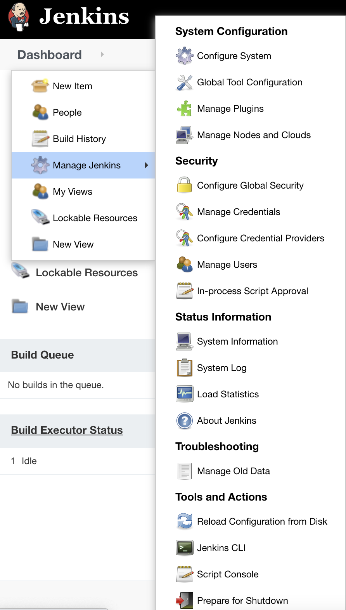
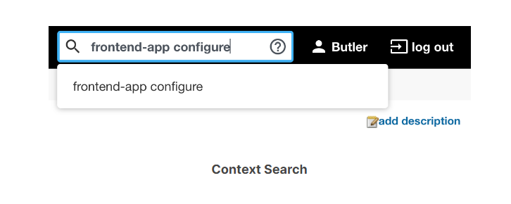
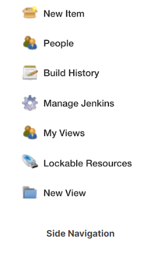
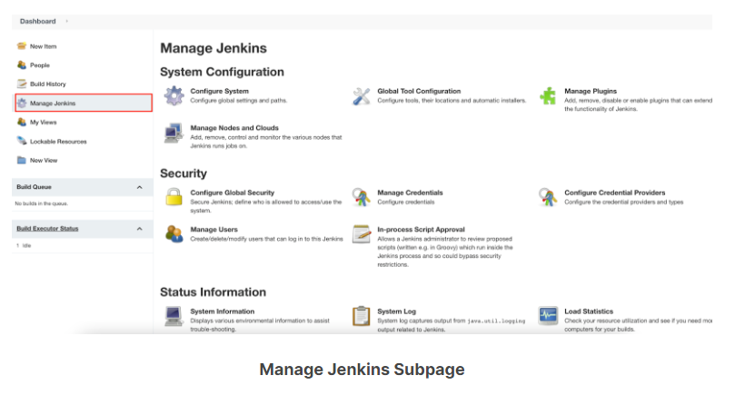
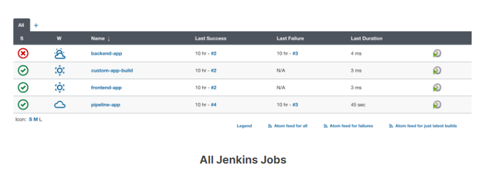
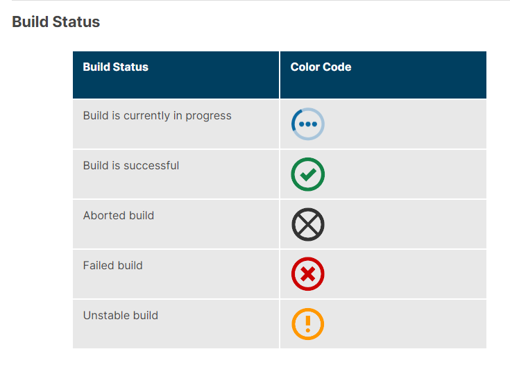
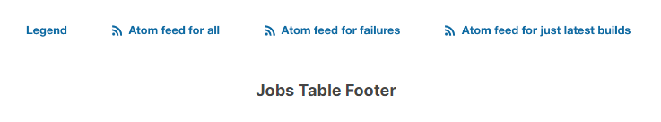
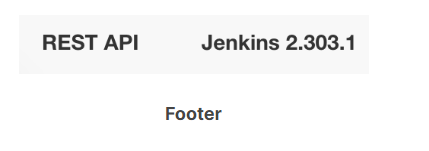

# Introducción

El dashboard de Jenkins es el punto de entrada principal para su interfaz de usuario de Jenkins. En este capítulo, brindaremos una descripción general del tablero de Jenkins: la información que muestra a los usuarios finales y sus capacidades principales.

# Secciones del Dashboard

El tablero de Jenkins es lo que ve cuando inicia sesión por primera vez en la interfaz de usuario de Jenkins. Exploremos el tablero y comprendamos algunas de sus capacidades principales.

El tablero consta principalmente de las siguientes secciones:

- Header
- Side Navigation
- All View for Jobs/Projects
- Monitoring Builds
- Footer

Echemos un vistazo a cada uno de estos, comenzando con el encabezado.

## Header (1)

El encabezado principal incluye los siguientes componentes:

- Breadcrumbs
- Add/edit description
- Context search box (next page)
- Logged in user dropdown (next page)

### Breadcrumbs

Las migas de pan son un sistema de navegación secundario que muestra la ubicación de un usuario en la interfaz de usuario de Jenkins. Estos le permiten navegar rápidamente a páginas específicas (o enlaces) dentro de la jerarquía actual.

### Add/Edit Description

Puede usar esto para agregar/editar texto en el tablero de Jenkins, trabajos, compilación, etc. El texto puede ser una nota, un recordatorio o cualquier cosa que pueda ser útil para su equipo.

### Context Search Box

El cuadro de búsqueda contextual le permite buscar contenido en todo Jenkins. De forma predeterminada, la búsqueda no distingue entre mayúsculas y minúsculas y resulta muy útil, ya que puede buscar rápidamente texto específico, trabajos de Jenkins, compilaciones, etc.

Por ejemplo, si necesita buscar el número de compilación 4 para un trabajo de Jenkins llamado "frontend-app", puede escribir simplemente **frontend-app 4**.

Si necesita ir directamente a la página de configuración para este trabajo, puede escribir **frontend-app configure**.

### Logged in User Dropdown

En la esquina superior derecha del encabezado, verá un menú desplegable vinculado a su nombre de usuario.

- **Build**: Esto muestra todas las compilaciones para el usuario.
- **Configure**:  Esto le brinda la posibilidad de configurar sus propios ajustes, claves ssh, dirección de correo electrónico, vistas personalizadas y mucho más.
- **My Views**: La "vista de todos" es la vista predeterminada para todos los usuarios. Sin embargo, puede crear su propia vista personalizada y establecer su vista predeterminada en su vista personalizada.
- **Credentials**: Puede ver las credenciales de usuario de su propia cuenta o cualquier otra credencial autorizada.

## Side Navigation

La barra de navegación lateral proporciona opciones de configuración de nivel superior inicial. Como mínimo, debería poder ver los elementos de configuración predeterminados.

- **New Item**: Esto se usa para crear nuevos trabajos de Jenkins.
- **People**: Esto le permite ver/modificar todas las cuentas de usuario que tienen acceso a la interfaz de usuario de Jenkins.
- **Build History**: Al hacer clic aquí, se abrirá una nueva subpágina, que muestra los trabajos de construcción, su estado y tendencia.
- **Manage Jenkins**: Aquí es donde puede realizar una variedad de tareas de administración, como configurar Jenkins, administrar complementos, configurar herramientas globales, seguridad, etc.

Tenga en cuenta que cualquier complemento que instale puede agregar elementos de configuración adicionales aquí. También vale la pena señalar que cada subpágina dentro de Jenkins tendrá sus propias opciones de configuración. Por ejemplo, si hace clic en el enlace Administrar Jenkins en la barra de navegación lateral, la subpágina mostrará las opciones de configuración específicas para Administrar Jenkins.

## All View for Jobs/Projects

Esta vista enumera todos los trabajos que están configurados en la instancia de Jenkins. También muestra el estado general de cada trabajo de Jenkins.

Para un trabajo dado en esta lista, se indica la siguiente información:

- **Build Status (S)**: Utiliza códigos de color (descritos a continuación con más detalle).
- **Health/Build Stability (W)**: Utiliza íconos meteorológicos (descritos a continuación con más detalle).
- **Job Name**
- **Last Success**: Muestra cuándo fue la última vez que el trabajo se generó correctamente y el número de compilación relacionado.
- **Last Failure**: Muestra cuándo fue la última vez que falló la compilación y el número de compilación relacionado.
- **Last Duration**: ¿Cuánto tiempo tardó en ejecutarse la última compilación?
- **(icono)**: Para iniciar una construcción.

## Jobs Table Footer

El pie de página de la tabla de trabajos enumera enlaces a la leyenda de todos los íconos en la tabla de trabajos y sus definiciones, así como fuentes RSS para todas las compilaciones, compilaciones fallidas y compilaciones más recientes.

## Monitoring Builds

Esta sección proporciona visibilidad general de las ejecuciones de trabajo de Jenkins. Le permite saber si su servidor Jenkins tiene demasiados o muy pocos recursos y puede ser muy útil para fines de planificación de la capacidad de TI. La supervisión de compilaciones tiene dos subsecciones, Cola de compilación y Estado del ejecutor de compilación.

**Build Queue**

La sección Build Queue muestra todos los trabajos que están actualmente en cola y esperando que un ejecutor se libere. Puede hacer clic en el trabajo en cola para recuperar más información sobre el trabajo. Como alternativa, puede cancelar el trabajo haciendo clic en el icono X de color rojo, que se muestra junto al trabajo.

**Build Executor Status**

El estado del ejecutor de la compilación enumera todas las compilaciones que cada agente configurado está actualmente en curso. Puede hacer clic en la barra de progreso para ver el resultado de la consola de compilación. También puede ver el tablero de Jenkins Node que enumera todos los nodos (controlador, agentes) haciendo clic en el enlace Build Executor.

Cubriremos nodos y agentes adicionales más adelante en este curso.

## Page Footer

En la esquina inferior derecha de la interfaz de usuario de Jenkins hay un enlace para Rest API. Este enlace le proporcionará información básica sobre cómo usar la API Rest para interactuar mediante programación con Jenkins. El uso de la API Rest es una alternativa para realizar varias operaciones a través de la interfaz de usuario de Jenkins.

