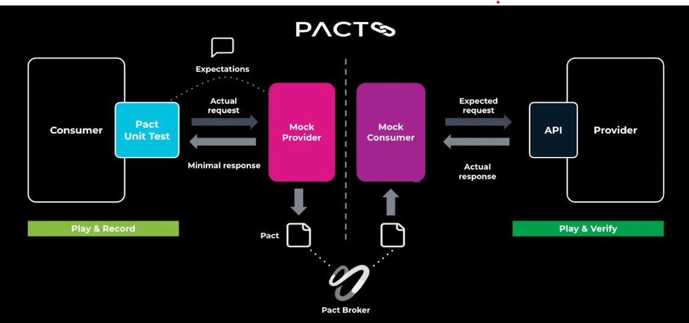
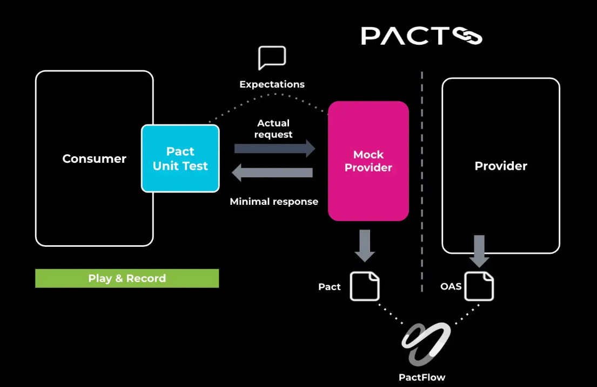

# 🧾 Introducción

A día de hoy, es extraño encontrarnos con un sistema que se desarrolle de manera “monolítica”, cada vez es más habitual, por las ventajas que ello supone, dividirlo en componentes más pequeños que se comunican entre sí para cubrir las necesidades esperadas. Esto hace que la funcionalidad no se encuentre concentrada en un único punto, si no que sea la colaboración de todas las partes la que dé sentido al sistema. Lo recomendable es que cada una de estas partes tenga programadas unas pruebas unitarias que verifiquen que el componente se comporte correctamente de manera aislada. No obstante, como bien sabemos, que cada módulo funcione correctamente de manera individual no garantiza que el sistema se vaya comportar adecuadamente en conjunto.

En este punto, se podría pensar que unas pruebas de integración del sistema completo serían la solución, y en cierta medida lo son, no obstante,en muchas ocasiones, no resulta sencillo realizar este tipo de pruebas bien por su complejidad, bien porque “levantar” todo el sistema no es sencillo, porque haya partes que aún no estén terminadas, etc. En definitiva, hay muchos factores que pueden hacer que en un entorno orientado a microservicios realizar una batería completa de pruebas de integración resulte altamente complejo.

En este tipo de situaciones, es donde enfoques como el del testing orientado a contratos aportan un mayor valor. En esencia, se trata de establecer lo que espera recibir el consumidor ante unas determinadas peticiones y posteriormente verificar que efectivamente el productor está enviando las respuestas esperadas, tanto en forma como en datos. Estos contratos se generan mediante el mockeo del servidor, por tanto, se crean antes de comenzar el desarrollo del mismo, de manera que se garantiza que éste produce en todo momento las respuestas adecuadas.

Esto favorece la detección temprana de errores, ya que estas pruebas no necesitan tener toda la infraestructura del sistema levantas, únicamente el proveedor que estemos desarrollando y deseemos validar. Por tanto, en el momento que el contrato deje de cumplirse por parte de dicho proveedor seremos informados del error.

# ✅ Ventajas en el ciclo de desarrollo

El Contract Testing desempeña un papel crucial en la mejora del ciclo de vida del desarrollo de software:

- **Mejora de la agilidad**
  Los equipos pueden desarrollar y lanzar servicios de forma independiente sin esperar a la integración completa del sistema. Esta autonomía permite realizar iteraciones más rápidas y reducir los plazos de entrega.

- **Aumenta la confianza en la integración**
  Aumenta la confianza en que los cambios en un servicio no afectarán inesperadamente a otros, reduciendo la necesidad de extensas pruebas manuales de integración.

- **Mejora de la calidad global**
  "Shifting left" ayuda a detectar errores de integración en una fase temprana del proceso de desarrollo, evitando que los problemas lleguen a entornos posteriores. Este enfoque proactivo conduce a versiones más estables y a una experiencia más fluida para los desarrolladores.

# 📝 Tipos de Contract Testing

## Consumer Driven

Con esta estrategia, el consumidor dirige la metodología (quién lo iba a esperar, dado el nombre...). El consumidor define las expectativas de la interacción. El contrato especifica las peticiones que el consumidor enviará y las respuestas que espera del proveedor, verificando que es capaz de gestionar las respuestas dadas. Los contratos se generan durante la fase de creación y prueba, en la que el marco de Pact pone en marcha un servidor simulado para validar las interacciones definidas. Si todo funciona como se espera, se genera un archivo de contrato.

Por otro lado, el proveedor es responsable de verificar cada uno de los contratos relacionados con él. El proveedor recupera los contratos relevantes de PactFlow (u otro Pact Broker), y las librerías Pact los utilizan durante la fase de construcción. El proceso implica iniciar un simulacro de consumidor que ejecutará las peticiones definidas contra el código real del proveedor, y verificar que las respuestas son las esperadas.

- **Puntos clave**

  - Los consumidores definen los contratos como "contratos mínimos viables".
  - El proveedor debe incluir un código relacionado con la verificación en sus clases de prueba para garantizar que se cumplen estos contratos.

Este planteamiento hace recaer en el consumidor la responsabilidad de definir lo que necesita, y el proveedor adapta su aplicación para satisfacer esas expectativas.

- **Casos prácticos**

En escenarios donde tienes control sobre ambos lados de la comunicación, como una arquitectura interna de microservicios, valoras cada componente, sabiendo no solo sobre quién consumen sino también quién los consume.

Buscamos que los componentes funcionen como un equipo, aunque estén gestionados por equipos diferentes.

## Bi-Directional

En este caso, el nombre no se explica por sí mismo. En el lado del consumidor, nada cambia; el marco sigue esperando el mismo proceso: definir las expectativas y ejecutar pruebas durante la fase de construcción y pruebas. El contrato se publica en PactFlow (nota: este enfoque no está soportado por el broker de pactos OSS, al menos no todavía).

La principal diferencia radica en el proveedor. Con las pruebas bidireccionales, el proveedor no necesita añadir código de prueba. En su lugar, se espera que el proveedor (o cualquier otro agente en su nombre) publique una Especificación OpenAPI (OAS) a PactFlow. Esta OAS debe ser válida (ya sea generada a partir de código o, si eso no es posible, al menos validada utilizando cualquier herramienta de prueba de su elección). PactFlow confiará en el equipo del proveedor para mantener esta OAS como la fuente de la verdad.

La verificación la realiza el propio PactFlow, comparando el contrato de pacto publicado por el consumidor con la especificación OAS del proveedor.

A partir de este momento, nada cambia. Los flujos de trabajo, la automatización y otros procesos siguen siendo los mismos.

- **Puntos clave**

Los consumidores siguen definiendo los contratos como "contratos mínimos viables".

El proveedor no necesita implementar código de prueba específico, simplemente necesita tener su OAS en PactFlow.

- **Casos prácticos**

Este enfoque tiene sentido cuando no se tiene (o no se quiere tener) control sobre la base de código del proveedor. Por ejemplo, podría tratarse de una API que se integra con demasiados consumidores como para hacer viables las pruebas personalizadas, tal vez una API heredada que ya no evoluciona, o incluso un componente de terceros. El objetivo es ofrecer una alternativa a las pruebas dirigidas al consumidor en situaciones en las que la participación directa del proveedor es limitada.

---

# Flujo de trabajo

## Consumer Driven



- El consumidor define las expectativas en su código base.

- Durante la fase de construcción y prueba, el marco Pact inicia un proveedor simulado para probar las expectativas utilizando peticiones reales.

- Si las pruebas se superan con éxito, se genera un archivo Pact (en formato JSON) y se publica en PactFlow o en el pact-broker.

**Del lado del proveedor (proceso independiente)**

- El proveedor comienza su proceso de construcción. Descarga todos los contratos relacionados de PactFlow o del intermediario de Pact durante la fase de prueba.

- Para cada contrato, el marco Pact inicia un servicio simulado de consumo y valida las expectativas utilizando solicitudes reales.

- Se publica una comprobación de verificación en PactFlow para los contratos que han sido verificados.

## Bi-Directional



- El consumidor define las expectativas en su código base.

- Durante la fase de construcción y prueba, el marco Pact inicia un proveedor simulado para probar las expectativas utilizando peticiones reales.

- Si las pruebas se superan con éxito, se genera un archivo Pact (en formato JSON) y se publica en PactFlow.

**Del lado del proveedor (proceso independiente)**

- El proveedor publica su Especificación OpenAPI (OAS) a PactFlow, ya sea generada a partir de código (preferido) o validada utilizando cualquier herramienta de prueba de su elección (este paso no está cubierto, ya que no es parte de la prueba de contrato en sí).

- PactFlow verificará la compatibilidad entre los contratos publicados y la OAS.

# Codificación

## Consumer Driven

En el lado del consumidor, tendrás varios pares como los que se muestran en el siguiente código. @Pact se utiliza para definir las expectativas, @PactTestFor se utiliza para probar las expectativas definidas, y el método @BeforeEach asegura que nuestras pruebas están apuntando al servidor falso iniciado por el framework.

**Código del consumidor**

```java
@SpringBootTest
@ExtendWith(PactConsumerTestExt.class)
class StudentProviderTest {

    public static final String STUDENT_1_EXISTS = "The student with ID 1 exists";

    private StudentService studentService;

    @Pact(consumer = "student-consumer", provider = "student-provider")
    public V4Pact getStudentWithId1(PactDslWithProvider builder) {
        return builder
            .given(STUDENT_1_EXISTS)
            .uponReceiving("Get an existing student")
            .path("/students/1")
            .method("GET")
            .willRespondWith()
            .status(200)
            .headers(Map.of("Content-Type", "application/json"))
            .body(newJsonBody(object -> {
                object.numberType("id", 1L);
                object.stringType("name", "Fake Name");
                object.date("birthDate", "yyyy-MM-dd", LocalDate.parse("2000-01-01"));
                object.numberType("credits", 30);
                object.stringMatcher("email", Regex.EMAIL, "some.email@sngular.com");
                object.object("address", address -> {
                    address.stringType("street", "123 Main St");
                    address.stringType("city", "AnyCity");
                    address.stringType("zipCode", "12345");
                });
                object.minArrayLike("enrolledCourses", 2, course -> {
                    course.stringType("courseName", "Introduction to Computer Science");
                    course.stringType("instructor", "Dr. Tech");
                    course.numberType("credits", 3);
                });
            }).build())
            .toPact().asV4Pact().get();
    }

    @BeforeEach
    void setup(MockServer mockServer) {
        RestTemplate restTemplate = new RestTemplateBuilder().rootUri(mockServer.getUrl()).build();
        studentService = new StudentService(restTemplate);
    }

    @Test
    @PactTestFor(pactMethod = "getStudentWithId1")
    void getStudentWhenStudentExists() {
        Student expected = getStudentSample();
        Student actual = studentService.getStudent(1L);
        assertStudentDetails(expected, actual);
    }
}


```

**Código del proveedor**

Mientras tanto, la parte proveedora tendría que añadir pruebas para cubrir todos los estados definidos en sus contratos con consumidores (como "Student 1 exists" en nuestro ejemplo).

```java
@PactBroker
@Provider("student-provider")
@SpringBootTest
class StudentProviderVerificationTest {

    public static final String STUDENT_1_EXISTS = "The student with ID 1 exists";

    @TestTemplate
    @ExtendWith(PactVerificationInvocationContextProvider.class)
    void verifyPact(PactVerificationContext context) {
        context.verifyInteraction();
    }

    @BeforeEach
    void setUp(PactVerificationContext context) {
        MockMvcTestTarget testTarget = new MockMvcTestTarget();
        testTarget.setControllers(studentController);
        testTarget.setControllerAdvices(customExceptionHandler);
        context.setTarget(testTarget);
    }

    @State(STUDENT_1_EXISTS)
    public void student1Exists() {
        Student student = createFakeStudent(1L);
        when(studentRepository.findById(1L)).thenReturn(Optional.of(student));
        when(studentRepository.findAll()).thenReturn(List.of(student));
    }
}

```

## Bi-Directional

El mismo código de ejemplo del consumidor es válido para la opción bidireccional. No hay ningún cambio en la forma de implementar, utilizar, automatizar o desplegar los contratos en el lado del consumidor.

En cuanto al proveedor, no tendrás que añadir código de prueba a tu código base. Recuerda que solo se requiere la especificación OpenAPI.

Idealmente, el mejor enfoque (IMHO) es generarlo directamente desde tu código usando herramientas como el springdoc-openapi-maven-plugin o cualquier otra herramienta de tu elección. También es válido generarlo externamente y validarlo utilizando herramientas de prueba como ReadyAPI, RestAssured, Dredd o Postman. Puedes encontrar un montón de ejemplos y documentación en la web de PactFlow:

- https://docs.pactflow.io/docs/bi-directional-contract-testing
- https://docs.pactflow.io/docs/examples

**Existen varias librerías que dan soporte a este tipo de pruebas. En esta charla me centraré en el uso de Pact.**

# Bibliografia

- https://www.sngular.com/es/insights/346/contract-testing-con-pact-la-guia-definitiva
- https://github.com/morvader/ContractTesting_Pact
